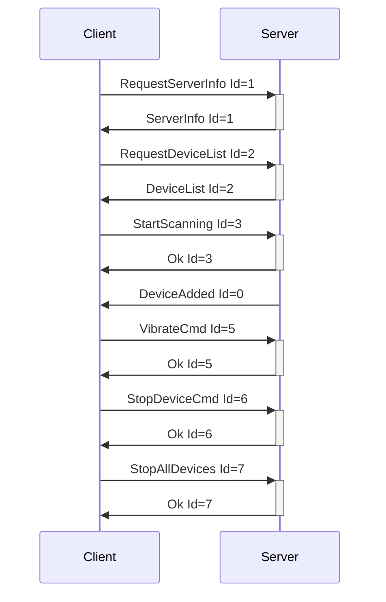

# Buttplug.py Documentation

This document contains a summary of the documentation for the `buttplug-py` library, collected via the `context7` tool.

The documentation covers the Buttplug protocol and client/server libraries, including device discovery, connection management, and command sending. Examples are provided in C#, JavaScript, Rust, Python, JSON, YAML, and Mermaid diagrams.

### Key Topics:
*   **Connecting to a Buttplug Server:** Examples are available for C#, JavaScript, and Rust.
*   **Device Scanning and Enumeration:** C#, JavaScript, and Rust examples are provided.
*   **Sending Commands to Devices:** Includes commands like `VibrateCmd`, `ScalarCmd`, and `LinearCmd`.
*   **Handling Device Events:** Covers `DeviceAdded`, `DeviceRemoved`, and `ScanningFinished`.
*   **Protocol Message Serialization:** JSON examples are available for all major commands.
*   **Configuration Files:** Device protocols can be configured using YAML and JSON.
*   **Websocket Device Manager (WSDM):** Integration and simulated device examples are provided in Python.
*   **WASM Initialization:** For browser-based JavaScript clients.
*   **Logging:** Setup instructions for Rust are included.
*   **Protocol Flow Diagrams:** Mermaid diagrams illustrate protocol flows and message lifecycles.

### Code and Documentation Snippets:

**Connecting to a Buttplug Server (C#)**
```csharp
// Example: Connect to Buttplug server, scan for devices, select and control a device
_client = new ButtplugClient("Example Client");
var connector = new ButtplugEmbeddedConnectorOptions();
await _client.ConnectAsync(connector);
await _client.StartScanningAsync();
// ... handle devices, send commands, etc.
```

**Device Control (JavaScript)**
```js
// Example: Connect to server, listen for deviceadded, send vibrate command
client.connect(connector).then(() => {
  client.on('deviceadded', (device) => {
    device.vibrate(1.0);
    setTimeout(() => device.stop(), 1000);
  });
});
```

**Device Protocol Message (JSON)**
```json
[
  {
    "ScalarCmd": {
      "Id": 1,
      "DeviceIndex": 0,
      "Scalars": [
        { "Index": 0, "Scalar": 0.5, "ActuatorType": "Vibrate" }
      ]
    }
  }
]
```

**Mermaid Sequence Diagram (Protocol Lifecycle)**


**Python Example (Simulated Device for WSDM)**
```python
# Connects to WSDM, identifies as Lovense device, handles protocol, prints vibration commands
# See: /examples/python/websocket-device-manager-example.py in docs.buttplug.io
```

**Configuration Example (YAML)**
```yaml
lovense:
  btle:
    names: [LVS-*, LOVE-*]
    services:
      50300011-0023-4bd4-bbd5-a6920e4c5653:
        tx: 50300012-0023-4bd4-bbd5-a6920e4c5653
        rx: 50300013-0023-4bd4-bbd5-a6920e4c5653
  defaults:
    name: Lovense Device
    messages:
      ScalarCmd:
        - StepRange: [0, 20]
          ActuatorType: Vibrate
```

**Summary:**
The Buttplug documentation provides comprehensive, multi-language examples and protocol details for building client/server applications, controlling devices, and integrating with the Buttplug ecosystem. For Python-specific usage, refer to the WSDM simulated device example and protocol JSONs. For protocol integration, reference the JSON/YAML message formats and Mermaid diagrams for workflow understanding.